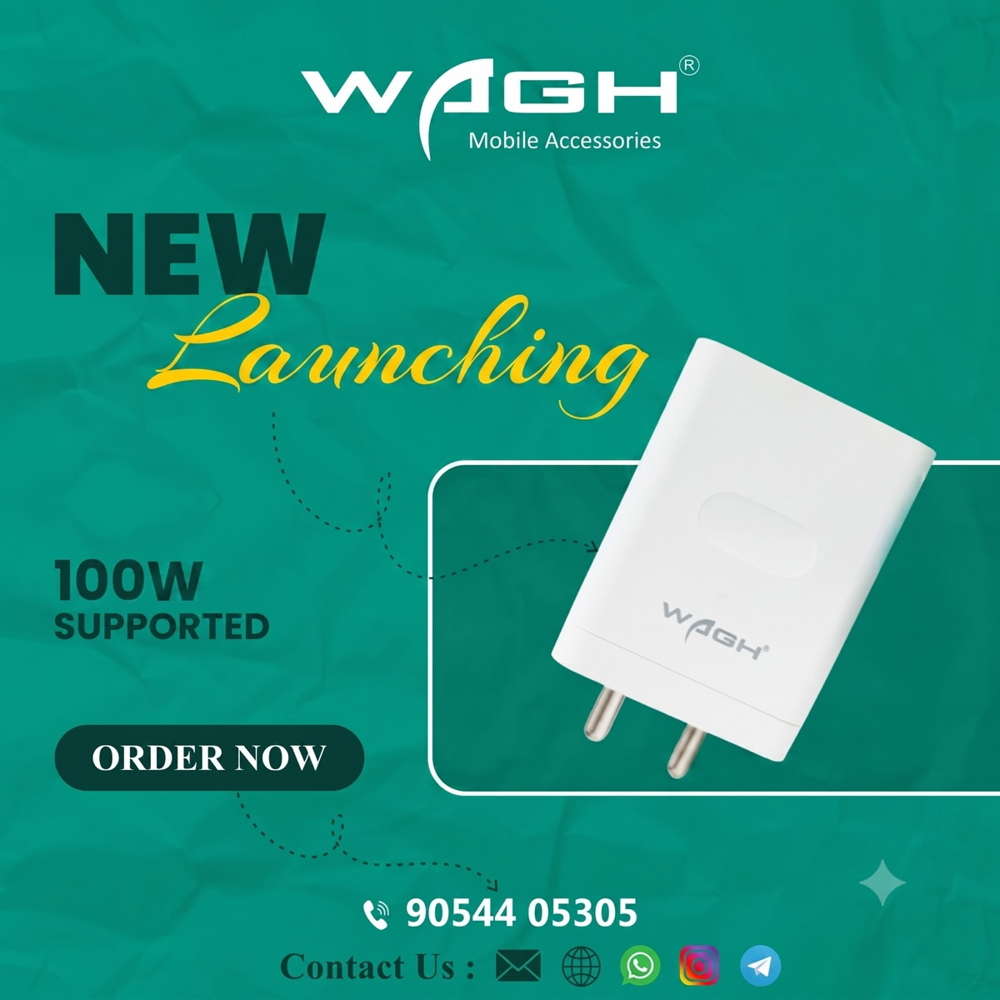

<div align="center">

  

  # ⚡ WAGH Mobile Accessories
  ### *Full-Stack MERN E-Commerce Platform*

  [](https://wagh-e-commerce.vercel.app/)
  [](https://github.com/devangpanchal23/1Wagh_E-Commerce)
  [](LICENSE)

  <br />

  > **"Power that feels premium. Speed you can trust."**
  >
  > A modern, end-to-end e-commerce platform for high-performance mobile accessories, featuring dynamic product catalogs, multi-image galleries, JWT authentication, cart & checkout workflows, and an admin management portal.

  <br />

  ```
  MongoDB  •  Express.js  •  React 18 (Vite)  •  Node.js  •  Tailwind CSS
  ```

</div>

---

## ✨ Key Features

- **🛍️ Storefront Catalog**: Live search, category filtering (Chargers, Power Banks, Cables, Audio), price sliders, and pagination.
- **🖼️ Interactive Product Page**: 4-image interactive gallery, technical specifications, stock status, and customer reviews.
- **🛒 Dynamic Cart & Checkout**: Quantity adjustments, promo code validation (`WAGH200`), Razorpay test gateway, and COD support.
- **🔐 User Dashboard & Wishlist**: Tabbed Auth (Login/Register), user profile management, order history tracking, and saved items.
- **🛡️ Admin Portal**: Auth-gated dashboard for product CRUD operations, multi-image URL uploads, order status updates, and sales stats.

---

## 💻 Tech Stack

| Layer | Technologies |
| :--- | :--- |
| **Frontend** | React 18, Vite, React Router v6, Tailwind CSS, Lucide Icons |
| **Backend** | Node.js, Express.js (REST API, MVC Architecture) |
| **Database** | MongoDB Atlas, Mongoose ORM |
| **Security** | JWT (JSON Web Tokens), `bcryptjs` Password Hashing |
| **Hosting** | Vercel (Frontend & Serverless deployment) |

---

## 🎨 Design System

- 🟢 **Primary Deep Teal**: `#0D5C52`
- 🟡 **Accent Amber Gold**: `#D4A94F`
- ⚪ **Background**: `#FAF9F6`
- 🔤 **Typography**: *Fraunces* (Headlines), *Manrope* (Body), *Space Mono* (Badges)

---

## ⚡ Quick Start Guide

### 1. Backend Setup

```bash
cd server
npm install
npm run seed     # Seeds MongoDB with sample products & admin user
npm run dev      # Starts REST API on http://localhost:5050
```

> **Default Seeded Accounts:**
> - **Admin**: `admin@wagh.com` / `admin123password`
> - **Customer**: `devang@example.com` / `customer123password`

### 2. Frontend Setup

```bash
cd client
npm install
npm run dev      # Starts React Vite dev server on http://localhost:5173
```

---

## 🗺️ Application Routes

- `/` — **Home** (Hero banner, Best Sellers, Flagship banner, Newsletter)
- `/shop` — **Shop Catalog** (Sidebar filters, sorting, search)
- `/product/:id` — **Product Detail** (Gallery, specs, customer reviews)
- `/cart` — **Cart** (Quantity stepper, promo codes, order summary)
- `/checkout` — **Checkout** (Address form, Razorpay / COD selection)
- `/profile` — **User Portal** (Auth, order history, wishlist)
- `/admin` — **Admin Portal** (Product CRUD, order management, stats)

---

## 📄 License & Credits

Distributed under the MIT License. Forked from [waghOnline/Wagh_E-Commerce](https://github.com/waghOnline/Wagh_E-Commerce) and maintained by [Devang Panchal](https://github.com/devangpanchal23).